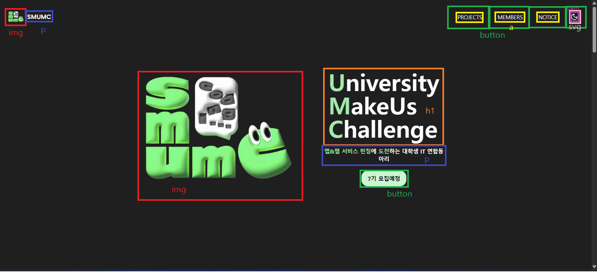
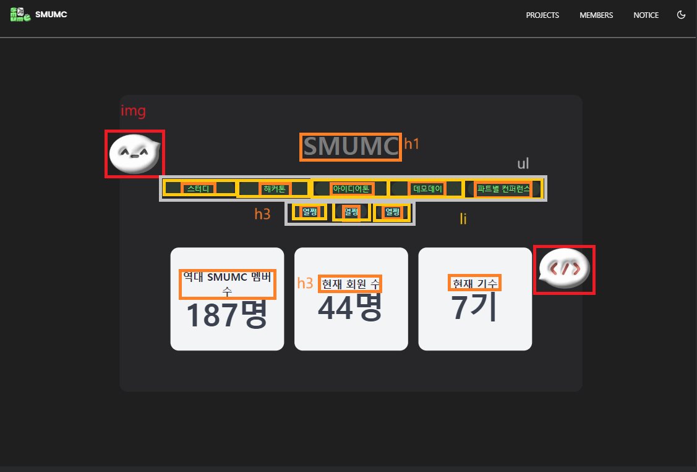
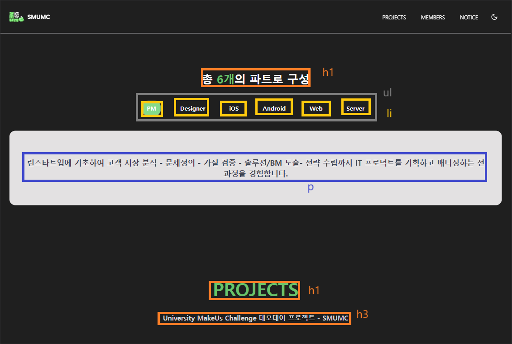
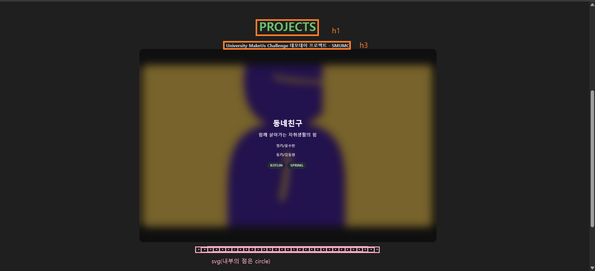
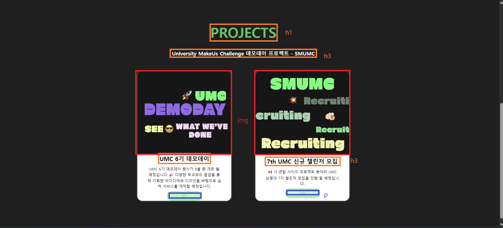
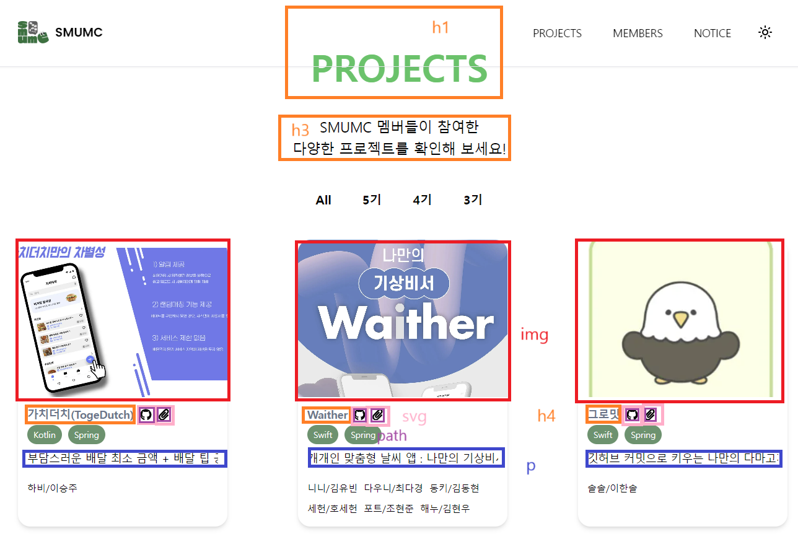
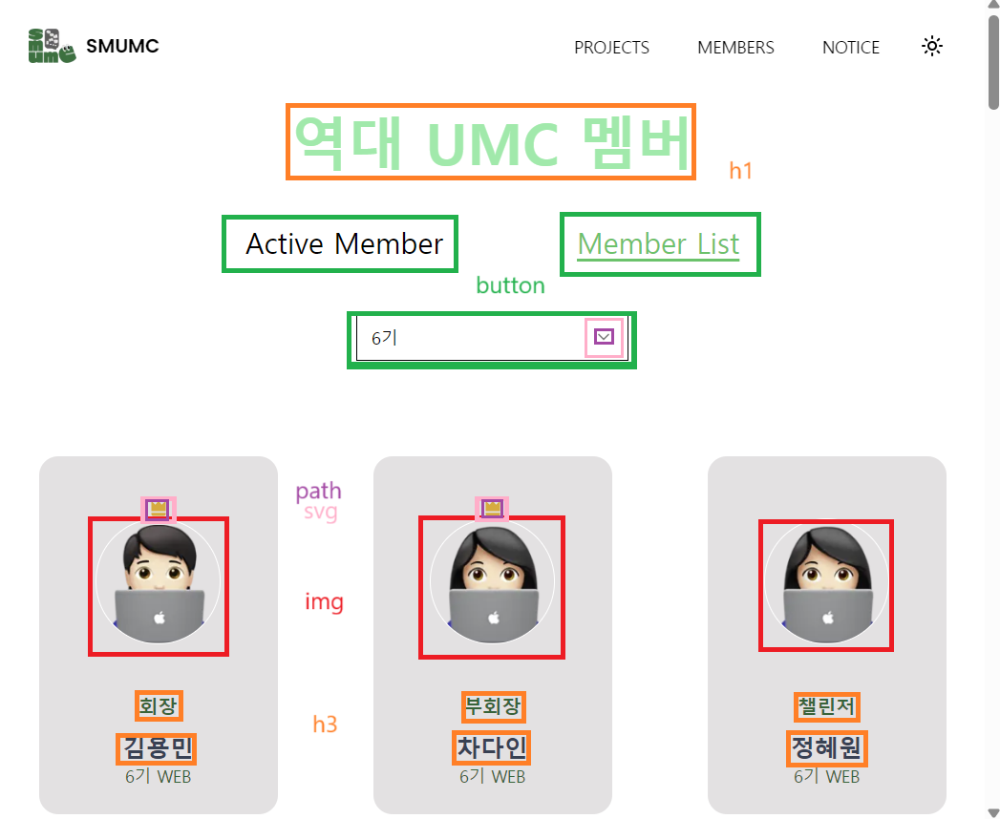
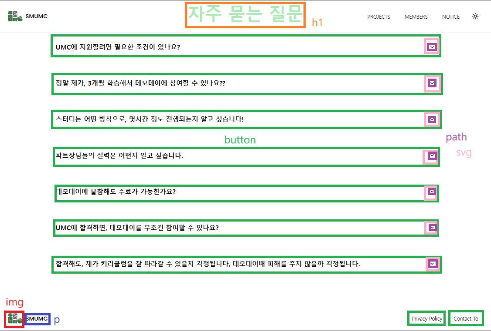

# 🏆 미션 1: **상명대학교 UMC 사이트 구조 분석**
**Semantic Tag**를 활용하여 **웹사이트를 구조 분해**한 결과를 인증합니다.
🔗 **[상명대학교 UMC 공식 사이트](https://www.smumc.co.kr/)**  

## 📌 **Semantic 태그를 활용한 구조 분석**
사이트의 주요 레이아웃과 구조를 **HTML5 Semantic Elements**를 기반으로 분해하였습니다.  
이를 통해 **각 요소가 어떤 역할을 수행하는지** 확인할 수 있습니다.

---

## **🖼 인증 이미지**
### 📍 메인 페이지 구조 분석

### 📍 메인 페이지 세부 구조 1

### 📍 메인 페이지 세부 구조 2

### 📍 메인 페이지 세부 구조 3

### 📍 메인 페이지 세부 구조 4

### 📍 프로젝트 페이지 분석

### 📍 멤버 페이지 분석

### 📍 공지 페이지 분석

